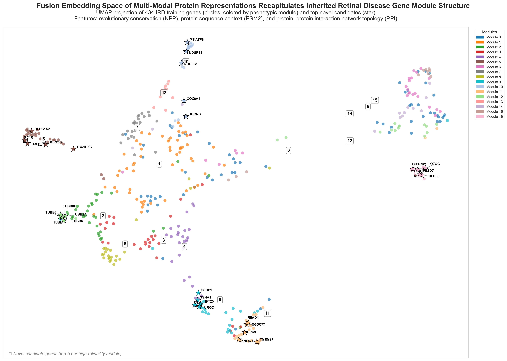

# pytorch-multimodal-gene-classifier

   
   

*A three-tower PyTorch fusion network that classifies human genes into inherited retinal dystrophy (IRD) phenotypic modules using evolutionary conservation, protein language model embeddings, and protein-protein interaction network topology - then applies the trained model genome-wide to surface novel candidate genes.*

---

> **Part of a broader research portfolio:** this repository is the flagship ML/DL extension of the [Evolutionary Genomics & Multi-Omics Portfolio](https://github.com/Shalev-CompBio/Shalev-Evolutionary-Genomics-Portfolio), building directly on the NPP and HPO-based phenotypic clustering methodology developed there.

---

## Overview

Fusing evolutionary conservation, protein sequence, and protein-interaction network topology, this model recovers known inherited retinal dystrophy (IRD) gene-phenotype relationships at 0.44 macro-F1 - roughly 7.5× the random baseline on a 17-class problem trained on only 434 genes. Protein interaction (PPI) network topology alone, unexpectedly, proved the single strongest predictor - stronger than evolutionary conservation, protein sequence, or all three combined.


A three-tower fusion model recovers known Inherited Retinal Diseases (IRD) gene-phenotype relationships at 0.40 macro-F1 (up to 0.77 F1 on individual phenotypic modules) - roughly 6.8× the random baseline on a 17-class problem trained on only 434 genes - by integrating evolutionary conservation, protein sequence, and protein-interaction (PPI) network topology.  

A PPI-only single-tower variant scores higher on average (0.44) - expected, since PPI representation is biased toward well-studied genes, and the 434 training genes are themselves already well-characterized IRD genes.
---

## Visual Portfolio

*For an interactive walkthrough of the research - click to launch:*

> [](https://shalev-compbio.github.io/Shalev-Evolutionary-Genomics-Portfolio/Visual_Portfolio/)
>
> *Narrative walkthrough of the research - NPP methodology, project case studies, and contact.*

---

## Repository Structure

```text
pytorch-multimodal-gene-classifier/
├── scripts/
│   ├── config.py                  # hyperparameters and constants
│   ├── dataset.py                 # PyTorch Dataset for multi-modal NPZ loading
│   ├── model.py                   # ThreeTowerClassifier architecture
│   ├── train.py                   # 5-fold stratified cross-validation training
│   ├── evaluate.py                # per-variant evaluation and confusion matrices
│   ├── inference.py                # genome-wide inference and concordance analysis
│   ├── align_npp_esm2.py          # data alignment: NPP × ESM2
│   ├── append_ppi_embeddings.py   # appends PPI to aligned datasets
│   └── umap_visualization_demo.ipynb  # UMAP of learned embedding space
├── HPC_run_public/                # sanitized SLURM/cluster pipeline, ready to adapt to any HPC environment
│   ├── esm2/                      # ESM2 embedding generation
│   ├── ppi/                       # STRING → node2vec embedding pipeline
│   └── README.md                  # variable reference, execution order, compute requirements
├── ppi/
│   ├── scripts/                   # local PPI pipeline: STRING ID mapping, edge list construction
│   └── processed/                 # intermediate mapping and edge list files
├── input/                         # committed documentation/sample files; real data is gitignored
│   ├── gene_classification_SAMPLE.csv  # synthetic demo file illustrating expected input format (real labeled dataset is confidential and not distributed)
│   └── DATA.md                    # data requirements and processing instructions
├── output/
│   ├── evaluation/                # confusion matrices and per-module metrics
│   ├── training/                  # cross-validation metrics per variant
│   └── figures/                   # UMAP visualization
├── docs/
│   ├── training_methodology.md    # methodology and results: two-tower ceiling → three-tower breakthrough
│   ├── inference_methodology.md   # genome-wide inference methodology and aggregate results
│   └── ppi_methodology.md         # STRING v12.0 → node2vec pipeline and biological validation
├── requirements.txt
└── .gitignore
```

`docs/` also contains per-run training logs and per-gene inference output locally - these stay private (gitignored), since they include candidate gene-level data pending biological validation and publication. The three files listed above are their public methodology and aggregate-results summaries.

---

## Research Question & Results

**The question:** can a deep learning model, built from three complementary representations of a gene - evolutionary conservation across roughly 1,900 species, a pretrained protein language model's view of its sequence, and its position in the human protein-protein interaction network - recover known inherited retinal dystrophy (IRD) gene-phenotype relationships well enough to be trusted for genome-wide candidate discovery, in a clinical area where a substantial fraction of cases still lack a confirmed causal gene?

**Built with:** PyTorch · deep learning (DL) · multi-modal fusion architectures · ESM2 protein language model embeddings · node2vec graph embeddings · scikit-learn

**The result:** combining all three modalities, and testing every possible sub-combination as a controlled ablation, surfaced PPI network topology as the single strongest predictor of IRD module membership - a result that was not anticipated going in.

| Variant | Val Macro-F1 (5-fold CV, mean ± SD) |
|---|---|
| `ppi_only` | **0.4379 ± 0.0502** — best overall |
| `fusion_3tower` | 0.4012 ± 0.0200 |
| `npp_ppi` | 0.3940 ± 0.0179 |
| `esm2_ppi` | 0.3936 ± 0.0127 |
| `npp_esm2` *(Phase 1 ceiling, no PPI)* | 0.2921 ± 0.0361 |
| `esm2_only` | 0.2488 ± 0.0241 |
| `npp_only` | 0.2212 ± 0.0179 |
| *Random baseline (1/17 classes)* | *~0.059* |

The best model reaches roughly **7.5× the random baseline** on a 17-class problem, trained on only 434 labeled genes. For context: a problem this small and this biologically noisy does not behave like image classification, where 95%+ accuracy is routine on clean, abundant data.  
A macro-F1 of 0.44 here reflects genuine biological heterogeneity within disease modules and a training set two orders of magnitude smaller than a typical deep learning benchmark - it is an honest, usable signal for prioritizing candidates, not a solved classification problem.

Applied genome-wide to ~19,573 unlabeled genes, just over half receive matching predictions from at least two independently-trained model variants, and a smaller, more selective subset achieves unanimous agreement across all variants tested - full breakdown of the concordance methodology and reliability framework in [`docs/inference_methodology.md`](docs/inference_methodology.md).  
One module that failed completely throughout the first project phase (F1 = 0 in most runs without PPI) produced its first strong result the moment PPI features were introduced - a concrete illustration of what this modality contributes that the others structurally cannot.


*434 labeled training genes projected into 2D via UMAP from the learned three-tower embedding space. High-reliability modules form visually distinct clusters, consistent with their validation performance.*

---

## Architecture

### Three-Tower Fusion Network

```text
NPP Tower: Linear(1905→64) → ReLU → Dropout(0.3) ────────────────┐
                                                                 │
ESM2 Tower: Linear(1280→128) → ReLU → Dropout(0.3) ──────────────┼── Concatenation (256-dim)
                                                                 │      │
PPI Tower: Linear(129→64) → ReLU → Dropout(0.3) ─────────────────┘      ▼
                                                                  Fusion Head
                                                                  Linear(256→64) → ReLU → Dropout(0.3) → Linear(64→17)
                                                                        │
                                                                        ▼
                                                                  Softmax over 17 IRD modules
```

The network integrates three independent modalities:
- **NPP**: 1905-dimensional evolutionary conservation profiles across ~1,900 species.
- **ESM2-650M**: 1280-dimensional protein language model embeddings (frozen).
- **PPI**: 128-dimensional node2vec embeddings generated from STRING v12.0 networks, plus a 1-bit coverage flag indicating genes that received mean-vector imputation rather than genuine network signal.

**Total trainable parameters (fusion_3tower):** 311,825

The architecture supports dynamic ablation studies using boolean flags (`use_npp`, `use_esm2`, `use_ppi`), enabling training and evaluation of all 7 possible tower combinations from a single codebase.

---

## Installation

```bash
git clone https://github.com/<your-username>/pytorch-multimodal-gene-classifier
cd pytorch-multimodal-gene-classifier
pip install -r requirements.txt
```
One note: pecanpy (PPI pipeline only) downgrades numpy to 1.26.4 due to numba constraints - install it in a separate environment if needed.

---

## Usage

> **A note on reproducibility:** This repository includes the full training and inference pipeline, code, and all aggregate results (cross-validation metrics, confusion matrices, the UMAP visualization). It does not include the labeled training dataset (confidential, pending publication) or trained model checkpoints (~25 MB, derived directly from that data). As a result, `train.py`, `evaluate.py`, and `inference.py` cannot be run end-to-end from a fresh clone. The code is provided for transparency, architecture review, and adaptation to your own labeled dataset of the same format (see `input/DATA.md`).

### Data preparation
Refer to `input/DATA.md` for full instructions.
```bash
python scripts/align_npp_esm2.py && python scripts/append_ppi_embeddings.py
```

### Training
Note: edit `VARIANTS` in `scripts/config.py` to select which tower combinations to train.
```bash
python scripts/train.py
```

### Evaluation
Outputs confusion matrices and per-module metrics to `output/evaluation/`.
```bash
python scripts/evaluate.py
```

### Genome-wide inference
Outputs per-variant predictions and concordance analysis to `output/inference/`.
```bash
python scripts/inference.py
```

---

## Experimental Design

434 labeled genes, 17 IRD modules (HPO-based clustering, thesis Stage 1), 5-fold stratified cross-validation, macro-F1 as primary metric (chosen specifically for class imbalance, since module sizes range from 10 to 63 genes). AdamW optimizer, early stopping on validation macro-F1, class-frequency-weighted cross-entropy loss.

Ablation strategy: one variable changed per run throughout nine controlled Phase 1 experiments (architecture size, regularization, augmentation, learning rate, class weighting), followed by a full 7-variant ablation across all combinations of the three modalities once PPI was introduced. Full run-by-run record in [`docs/training_methodology.md`](docs/training_methodology.md).

---

## Future Work

- Fourth tower: tissue expression data (Human Protein Atlas, chosen over GTEx for its retinal tissue coverage), planned as an independent post-hoc validation layer rather than additional training input
- Investigating why the PPI-only model outperforms the full three-tower fusion - architecture (fusion mechanism, capacity) and data (study bias in curated interaction databases) are both live hypotheses, discussed in [`docs/training_methodology.md`](docs/training_methodology.md)
- Biological sanity-checking of top genome-wide candidates against independent expression and locus evidence

---

## Acknowledgments

The Tabach Lab, Hebrew University of Jerusalem. STRING database v12.0. ESM2 (Meta AI). The HUJI Moriah HPC cluster.

This model's training labels derive from the HPO-based phenotypic module clustering (Stage 1) developed in the [Evolutionary Genomics & Multi-Omics Portfolio](https://github.com/Shalev-CompBio/Shalev-Evolutionary-Genomics-Portfolio).

---

## Contact & Affiliation

- **Lab**: [Prof. Yuval Tabach Lab](https://tabach-lab.com/), Faculty of Medicine
- **Institution**: Hebrew University of Jerusalem
- **Role**: M.Sc. Candidate in Genomics & Bioinformatics

---

> This is an active MSc research project. Results presented here are hypothesis-generating - statistically supported candidates for follow-up, not clinically validated findings. Gene-level outputs from genome-wide inference are withheld pending biological validation and publication.
>
> Questions, feedback, and collaboration inquiries are welcome via the contact details on the [visual portfolio site](https://shalev-compbio.github.io/Shalev-Evolutionary-Genomics-Portfolio/Visual_Portfolio/).

---

**Built as part of ongoing MSc research at the Hebrew University of Jerusalem, Tabach Lab - ML/DL applied to inherited retinal disease gene discovery.**

---
